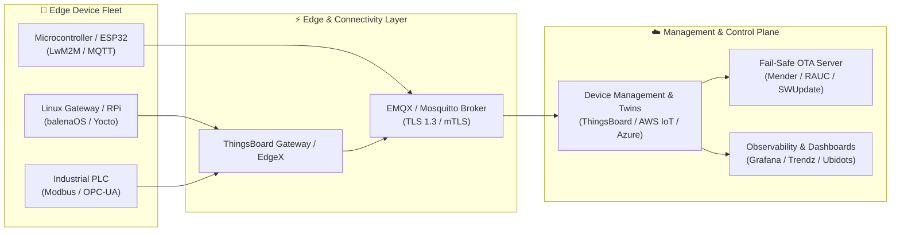

  

# 🌐 Awesome IoT Device Management 🚀

  
  
  
  
  
  
  

---

## 📖 Overview & Ecosystem Guide

A comprehensive, curated landscape of **SaaS Cloud Platforms**, **Edge Orchestration Engines**, and **Open-Source GitHub Frameworks** for **IoT Device Management**.

These systems automate the end-to-end lifecycle of connected fleets:
* 🔑 **Zero-Touch Provisioning & Identity**: Secure onboarding, cryptographic authentication (X.509, TPM, Secure Element), and digital twins.
* 🛰️ **Over-The-Air (OTA) Updates**: Fail-safe A/B dual-partition OS flashing, atomic application updates, delta payloads, and rolling canary deployments.
* 📡 **Fleet Telemetry & Protocol Gateways**: Ultra-low-latency bidirectional messaging over MQTT, CoAP, LwM2M, HTTP, and OPC-UA.
* 🛡️ **Remote Access & Diagnostics**: Secure SSH tunneling, TCP/UDP reverse proxying, live log streaming, and device health monitoring.
* ⚡ **Edge Computing & Container Orchestration**: Docker/K3s-based application deployment, edge stream processing, and local ML inference.

---

## 📑 Table of Contents

* [☁️ SaaS & Hosted Platforms](#-saashosted-platforms)
* [🔓 Open-Source GitHub Frameworks](#-open-source-github-projects)
* [🏗️ IoT Architectural Patterns](#️-iot-architectural-patterns)
* [📈 Star History](#-star-history)
* [🤝 How to Contribute](#-how-to-contribute)
* [⚖️ Disclaimer](#️-disclaimer)

---

## ☁️ SaaS/Hosted Platforms

> 📊 **Sector Market Size & Structure**: The global **IoT Device Management** market is estimated at **$10.5B – $11.0B in 2026** and projected to expand at a **17% – 28% CAGR**. The sector exhibits **moderate concentration with high operational fragmentation**: while hyperscalers (Microsoft Azure, AWS) capture enterprise core infrastructure, specialized platforms (Balena, Particle, EMQX, ThingsBoard, ClearBlade) dominate container edge orchestration, cellular bundling, high-throughput MQTT brokerages, and industrial automation niches.

The table below is sorted by **Company Size (Market Cap / Valuation / Revenue)** in descending order:

| 🏢 Platform | 📝 Description | 💰 Starting Pricing | 🎁 Free Tier / Trial Limits | 📊 Company Size (Valuation / Revenue) |
| :--- | :--- | :--- | :--- | :--- |
| **[Azure IoT](https://azure.microsoft.com/en-us/products/iot-hub/)** | Microsoft’s IoT Hub and device management suite for digital twins, device provisioning (DPS), and cloud-to-device messaging within Azure. | Starts at **$10/mo** (Basic B1 unit: 400k msgs/day) / **$25/mo** (Standard S1 unit: 400k msgs/day with device twins & jobs) | **Free forever** (F1 Free Tier): Up to 500 connected devices, 8,000 messages/day (0.5 KB meter size; 1 free hub per subscription) | **~$3.1T Market Cap** (Microsoft) / ~$245B Annual Revenue |
| **[AWS IoT Device Management](https://aws.amazon.com/iot-device-management/)** | Amazon Web Services fleet management service for bulk registration, fleet indexing, fine-grained device jobs, and secure remote tunneling. | **$0.10** per 1k devices registered, **$0.003** per remote action/job (first 250k actions), **$2.25** per 1M index updates, **$0.05** per 10k searches | **12-month free trial**: 50 remote actions/mo free (plus $200 new customer AWS Free Tier credits) | **~$2.0T Market Cap** (Amazon) / ~$600B Annual Revenue |
| **[Losant](https://www.losant.com/)** | Enterprise low-code IoT application enablement and edge platform with visual workflow engines, fleet dashboards, and edge gateways. | Starts at **$250/mo** (Launch plan: includes 100k payloads/mo; Growth plan at $1,000/mo for 500k payloads) | **Free forever** (Developer Sandbox): Up to 10 devices and 30-day data retention; **60-day free trial** (Enterprise Trial) with unlimited devices | **~$2.5B Enterprise Value** (SUSE subsidiary) / ~$650M Revenue (SUSE) |
| **[Particle](https://www.particle.io/)** | Integrated full-stack IoT platform combining cellular/Wi-Fi hardware modules, global connectivity (EtherSIM), Device Cloud, and OTA fleet updates. | Starts at **$299/mo** (Growth plan block: includes 100 devices, 720k data operations/mo, 540 MB cellular data) | **Free forever** (Sandbox plan): Up to 100 devices, 100,000 data operations/mo, 100 MB cellular data/mo | **~$50M Acquisition** (Jan 2026 by Digi Int'l, ~$800M Market Cap) / ~$81.3M Prior Funding / ~$20M ARR |
| **[EMQX Cloud](https://www.emqx.com/en/cloud)** | Fully managed, serverless, and dedicated cloud-native MQTT messaging platform built for massive IoT concurrency and streaming data integration. | Serverless: **$0.15/GB** traffic over quota; Dedicated Flex starts at **$234/mo** (~$0.32/hour for isolated clusters) | **Free forever** (Serverless plan): Up to 1,000 concurrent connections, 1M session minutes/mo, 1 GB traffic/mo; **14-day free trial** for Dedicated Flex | **~$150M+ Valuation** (EMQ Technologies) / ~$40M+ Total Funding / ~$20M+ ARR |
| **[Balena](https://www.balena.io/)** | Container-based edge device management platform optimized for embedded Linux fleets — Docker-style container deployment, balenaOS, and remote CLI. | Starts at **$159/mo** (Prototype plan: includes first 30 devices, +$3/device/mo for additional devices) | **Free forever**: Up to 10 devices with full platform features (open/public fleets are completely unlimited) | **~$50M – $100M Valuation** / ~$31M+ Funding (backed by LoneTree Capital) / ~$10M – $25M ARR |
| **[ClearBlade](https://www.clearblade.com/)** | Edge-native IoT, AI, and digital twin platform specializing in low-latency industrial edge computing and drop-in Google IoT Core replacement. | IoT Core: **$0.0045/MB** (for 250 MB – 250 GB/mo), scaling to **$0.0020/MB** (250 GB – 5 TB); 1024-byte min message charge | **Free forever** (IoT Core): First 250 MB data volume/mo free (device manager CRUD operations are completely free) | **~$50M – $100M Valuation** / ~$19.3M Total Funding / ~$10M – $25M Revenue |
| **[ThingsBoard Cloud](https://thingsboard.io/)** | Fully managed cloud edition of the ThingsBoard IoT platform providing multi-tenant entity management, Rule Engine processing, and interactive dashboards. | Starts at **$49/mo** (Prototype plan: 30 devices, 30 assets, 3M data points/mo; Pilot plan at $149/mo) | **Free forever** (Free Plan): Up to 5 devices, 5 assets, and 1,000,000 data points/month | **Bootstrapped & Profitable** (ThingsBoard, Inc.) / ~$10M – $15M ARR / 2,000+ commercial enterprise deployments |
| **[Kaa IoT](https://www.kaaiot.io/)** | Enterprise IoT platform tailored for rapid device provisioning, sensor data collection, digital twins, and end-to-end industrial device lifecycle tracking. | Starts at **$99/mo** (Cloud plan: up to 100 active devices/endpoints; $15/mo for managed Node-RED hosting) | **Free forever**: Up to 5 devices (endpoints) with core telemetry & dashboard features; **14-day free trial** for Enterprise features | **Bootstrapped & Profitable** (CyberVision spinoff) / ~$5M – $10M Revenue / 100k+ managed endpoints |
| **[Ubidots](https://ubidots.com/)** | Low-code IoT application platform focused on intuitive visualization, automated alerts, time-series data storage, and client white-labeling. | Starts at **$99/mo** (Professional plan: 50 devices, 10M dots/data points, 5 organizations, 6-month retention) | **Free forever** (Ubidots STEM): Up to 3 devices (non-commercial, 4,000 dots/day ingestion, 1-month retention); **30-day free trial** for commercial tier | **Bootstrapped & Profitable** / ~$5M – $8M ARR / 100k+ registered developers & 4k+ active customers |

---

## 🔓 Open-Source GitHub Projects

The open-source ecosystem provides robust self-hosted building blocks for complete independence, on-premises privacy, and custom firmware pipelines.

The list below is sorted by **GitHub Star Count** in descending order:

1. **[ThingsBoard](https://github.com/thingsboard/thingsboard)**   
   🏆 *The leading open-source IoT platform (Apache 2.0)* — Provides comprehensive device management, multi-tenancy, telemetry data collection, high-performance rule engine, and real-time visualization dashboards. Fully self-hostable via Docker/Kubernetes.

2. **[EMQX](https://github.com/emqx/emqx)**   
   ⚡ *High-performance distributed MQTT broker (Apache 2.0)* — Built on Erlang/OTP, capable of scaling to 100M+ concurrent IoT device connections with sub-millisecond latency and high-throughput data bridging to Kafka, PostgreSQL, and InfluxDB.

3. **[Eclipse Mosquitto](https://github.com/eclipse-mosquitto/mosquitto)**   
   🪶 *Lightweight open-source MQTT message broker (EPL-2.0 / EDL-1.0)* — The de-facto standard lightweight broker for embedded Linux boards, Raspberry Pi, home automation, and gateway-level protocol routing.

4. **[KubeEdge](https://github.com/kubeedge/kubeedge)**   
   ☸️ *Kubernetes-native edge computing framework (CNCF Incubating)* — Seamlessly extends cloud-native container orchestration and Kubernetes APIs to autonomous remote edge nodes and IoT peripherals via MQTT/EdgeMesh.

5. **[Magistrala](https://github.com/absmach/magistrala)**   
   🌐 *Modern Go-based multi-protocol IoT framework (formerly Mainflux, Apache 2.0)* — Supports multi-protocol connectivity (MQTT, HTTP, CoAP, WebSocket), fine-grained authorization, TLS mutual auth, and digital twin state modeling.

6. **[ThingsBoard IoT Gateway](https://github.com/thingsboard/thingsboard-gateway)**   
   🌉 *Industrial protocol connector and edge gateway* — Bridges legacy OT protocols including Modbus, CAN bus, BACnet, BLE, OPC-UA, and REST into modern MQTT/ThingsBoard instances.

7. **[Baetyl](https://github.com/baetyl/baetyl)**   
   📦 *Linux Foundation edge computing and microservice runtime* — Extends cloud computing, message routing, edge application management, and containerized AI models seamlessly to resource-constrained devices.

8. **[OpenRemote](https://github.com/openremote/openremote)**   
   🏢 *100% open-source IoT platform for asset management and smart cities (AGPL-3.0)* — Features comprehensive asset modeling, flow-based rules, protocol agents (HTTP, MQTT, KNX, Modbus), and custom mobile/web frontends.

9. **[SWUpdate](https://github.com/sbabic/swupdate)**   
   🔄 *Embedded Linux software update framework (GPL-2.0)* — Highly reliable OTA updater supporting dual-copy (A/B) disk partitioning, encrypted artifacts, delta compression, and integration with Hawkbit and Suricatta servers.

10. **[LF Edge eKuiper](https://github.com/lf-edge/ekuiper)**   
    🌊 *Lightweight IoT edge stream processing and SQL engine (Apache 2.0)* — Runs on microcontrollers and Linux gateways with < 10MB memory footprint, performing real-time SQL stream analytics and AI inference at the edge.

11. **[EdgeX Foundry](https://github.com/edgexfoundry/edgex-go)**   
    🏭 *Vendor-neutral industrial IoT edge middleware (Apache 2.0)* — Modular microservices architecture standardizing device abstraction, dual-direction data flows, edge computing, and sensor-to-cloud security.

12. **[openBalena](https://github.com/balena-io/open-balena)**   
    🐳 *Self-hosted open-source backend for balena device fleets (Apache 2.0)* — Deploy and manage fleets of containerized balenaOS devices, push updates via Git, and manage environment variables on your own servers.

13. **[RAUC](https://github.com/rauc/rauc)**   
    🛡️ *Safe and secure software update controller for embedded Linux (LGPL-2.1)* — Ensures robust A/B atomic firmware updates with cryptographic X.509 signature verification, fail-safe bootloader integration (U-Boot, Barebox, GRUB), and streaming installation.

14. **[Mender Client](https://github.com/mendersoftware/mender)**   
    🚀 *Open-source OTA software update client for embedded Linux (Apache 2.0)* — Provides robust dual-rootfs rollbacks, application container updates, delta updates, and fleet deployment management.

15. **[balenaOS (meta-balena)](https://github.com/balena-os/meta-balena)**   
    🐧 *Yocto Linux distribution tailored for running containers on edge devices* — Features atomic dual-rootfs rollbacks, balenaEngine (lightweight Docker alternative), and network-resilient provisioning.

16. **[Eclipse Ditto](https://github.com/eclipse-ditto/ditto)**   
    🪞 *Digital Twin framework for IoT (EPL-2.0)* — Provides a unified software representation of physical devices, state synchronization, access control, and bidirectional signaling between hardware and cloud.

17. **[Eclipse Hono](https://github.com/eclipse-hono/hono)**   
    🔌 *Cloud-scale IoT device connectivity layer (EPL-2.0)* — Normalizes communication over HTTP, MQTT, AMQP, and CoAP into standard Kafka/AMQP endpoints independent of the underlying network protocol.

18. **[DeviceHive](https://github.com/devicehive/devicehive-java-server)**   
    🐝 *Microservice-based IoT data platform (Apache 2.0)* — Provides device registration, real-time message streaming over WebSockets/REST, and access control for smart hardware fleets.

19. **[Eclipse Kapua](https://github.com/eclipse-kapua/kapua)**   
    🧩 *Modular IoT integration platform and device registry (EPL-2.0)* — Manages device configurations, multi-tenant accounts, user permissions, and telemetry archiving under the Eclipse IoT ecosystem.

---

## 🏗️ IoT Architectural Patterns

When architecting production-grade device management, engineering teams typically implement one of three standard operational topologies:

### 💡 Recommendation Guide:
* **Full-stack Turnkey Cellular/Hardware**: Use **[Particle](https://www.particle.io/)** for zero-friction end-to-end cellular connectivity and device cloud.
* **Linux Container Fleets**: Use **[Balena](https://www.balena.io/)** or **[openBalena](https://github.com/balena-io/open-balena)** for Docker-like developer ergonomics at the edge.
* **Large-Scale Custom Architecture**: Deploy **[EMQX](https://github.com/emqx/emqx)** as the 100M+ connection messaging backbone, **[ThingsBoard](https://github.com/thingsboard/thingsboard)** for rule processing and telemetry, and **[RAUC](https://github.com/rauc/rauc)** / **[Mender](https://github.com/mendersoftware/mender)** for deterministic A/B OS firmware flashing.
* **Cloud Native Enterprise Ecosystem**: Leverage **[Azure IoT](https://azure.microsoft.com/en-us/products/iot-hub/)** or **[AWS IoT Device Management](https://aws.amazon.com/iot-device-management/)** for native integration with enterprise data lakes and compliance governance.

---

## 📈 Star History

---

## 🤝 How to Contribute

Contributions are warmly welcome! Follow these steps:

1. 🍴 Fork the repository.
2. 🌿 Create a feature branch (`git checkout -b add-platform-name`).
3. 📝 Add your entry with factual descriptions, active links, specific pricing, and exact free tier/trial limits.
4. 🚀 Submit a Pull Request referencing the category and relevant documentation.

---

## ⚖️ Disclaimer

* This repository is a **community-curated index** created for educational and architectural reference.
* IoT device management systems control physical assets in mission-critical and industrial environments. Secure cryptographic identity, mutual TLS encryption, least-privilege role-based access control, and robust fail-safe OTA rollbacks are mandatory for operational safety. Always thoroughly test firmware update sequences in isolated test environments prior to production rollout.

---

  <b>Maintained with ❤️ for IoT platform engineers, hardware architects, and fleet operators worldwide.</b>

